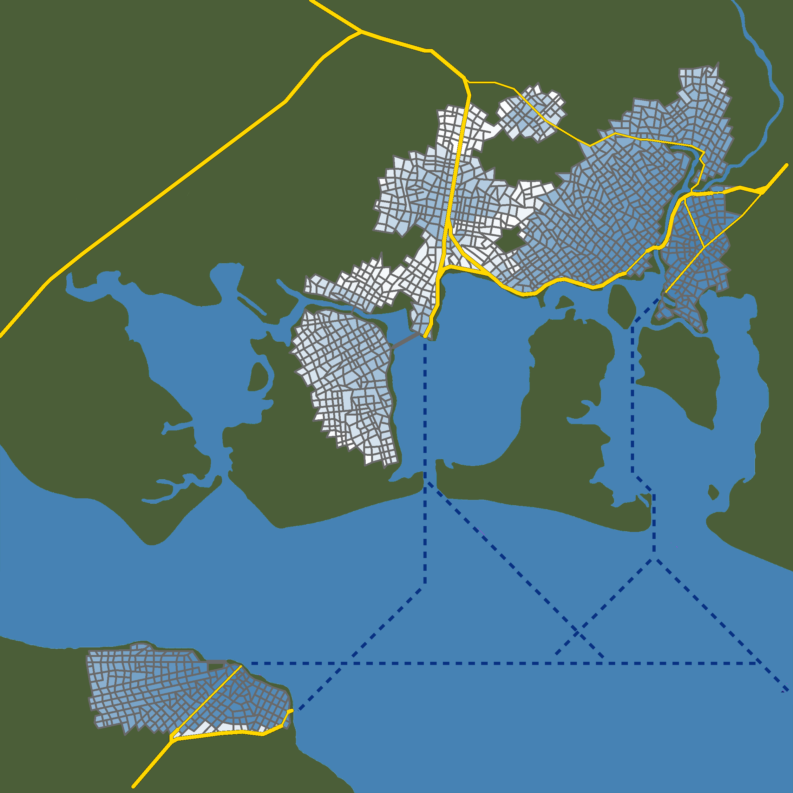
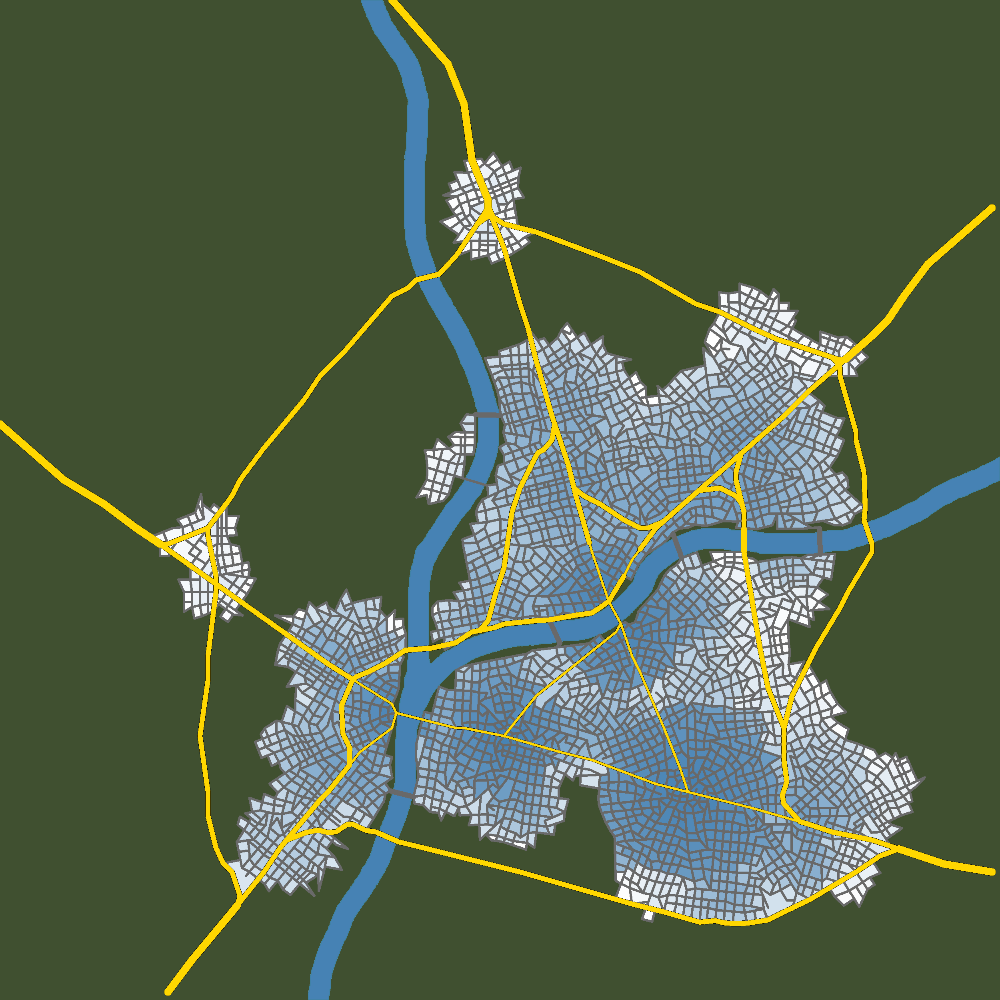
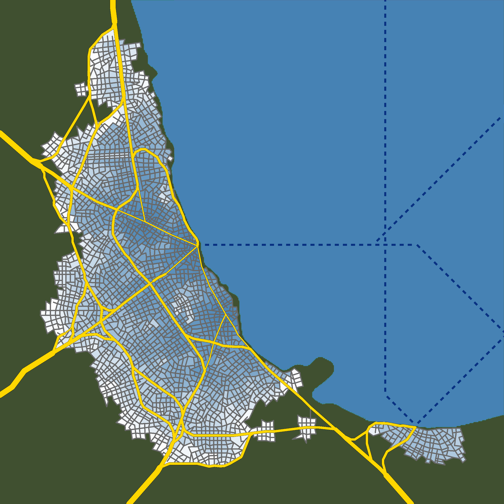

## Contents
- [Initialization](#c1)
- [Growing minor roads ](#c2)
- [Traffic simulation](#c3)
- [Growing major roads](#c4)


<a name="c1" />

## Initialization

One by one, the algorithm builds major roads that connect pairs of neighbouring cities n nc, resulting in an initial road network, we find all intersections and use then as the initial nuclei of city growth. 





    ``` c++
        double p,r;   
    p = 1, r = 0; 
    Function m0 = 
    ```

   ``` cmd
   mkdir build
   cd build
   cmake ..
   make && ./out
   ```

<a name="c2" />

## Growing minor roads  

With the positions of nuclei of city growth in mind, we select positions out of which new minor roads can grow. We then grow these new minor roads using the appropiate minor road pattern. 

<a name="c3" />

## Traffic simulation

For each pair of neighbouring cities,
we keep track of the total traffic between them. This traffic
can flow across one or more different trade routes, which
are paths running entirely over major roads. If the available traffic capacity between a pair of neighbouring cities
is greater or equal to the increase t(t) − t(t − 1) in traffic, no new major road is required and we only increase
the traffic. Otherwise, a new major road might have to be
created.

<a name="c4" />

## Growing major roads

If there is not enough available
capacity to accommodate the increase in traffic, a new major road might have to be built. We therefore propose 1) a
new major road that is subject to the major road construction parameters R(t). This road might consist entirely of
new major roads, reuse existing minor and major roads,
or both, and 2) as an alternative, we consider re-routing
the surplus traffic over already existing major roads. Out
of these two options, we choose the better one and add a
new trade route that runs along it, thus accommodating for
the increase in traffic. Finally, we increase the simulation
time t and go back to step 2.


   